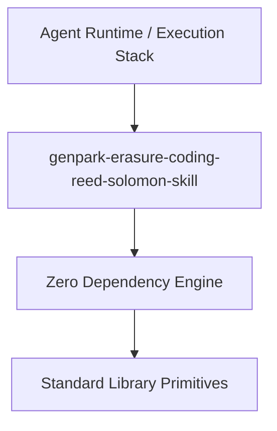

# genpark-erasure-coding-reed-solomon-skill

[](https://github.com/alphaparkinc/genpark-erasure-coding-reed-solomon-skill)
[](https://github.com/alphaparkinc/genpark-erasure-coding-reed-solomon-skill)
[](https://www.python.org/)

Reed-Solomon (k+m) systematic erasure coding kernel over Galois Fields GF(2^8) tolerating up to m disk or network shard dropouts.



## Features
- **Strict 0 Pip Dependencies**: Built completely using the Python Standard Library.
- **Fast Execution & Verification**: Includes client wrapper, MCP server, and verified test suites.
- **Agentic AI Ready**: Exposes standard MCP tools for continuous LLM integration.

## Installation & Quickstart
```bash
git clone https://github.com/alphaparkinc/genpark-erasure-coding-reed-solomon-skill.git
cd genpark-erasure-coding-reed-solomon-skill
python example_usage.py
```
